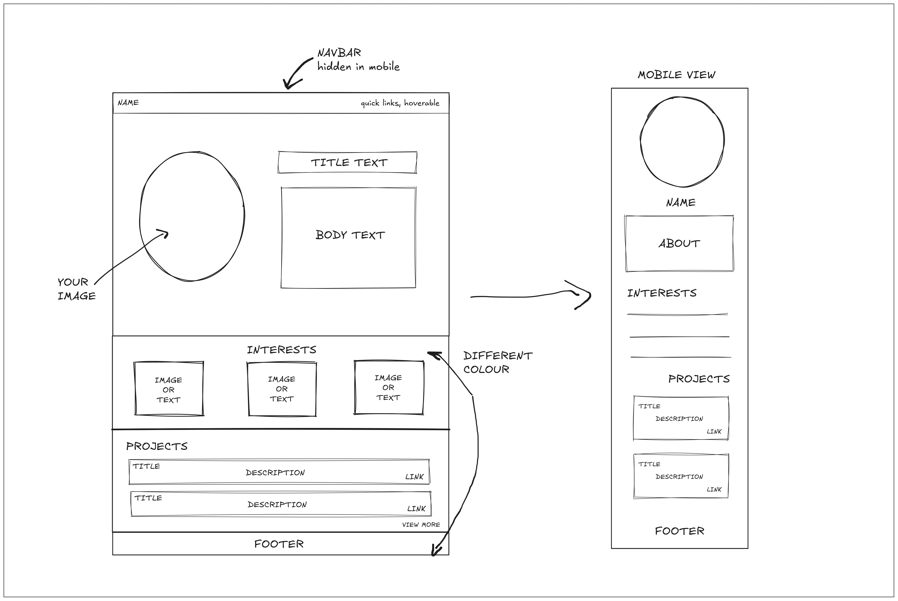

# Portfolio Website

## Most Common Website Layout

<center>  </center>

## Table of Contents

1. [Introduction](#introduction)
2. [HTML Basics](#html-basics)
3. [CSS Basics](#css-basics)
4. [Building Our Portfolio](#building-our-portfolio)
5. [JavaScript Integration](#javascript-integration)
6. [Best Practices](#best-practices)

## Introduction

This guide explains how to build a portfolio website using HTML and CSS, suitable for complete beginners. We'll cover the structure (HTML) and styling (CSS) of the website, explaining each component in detail.

## HTML Basics

### Basic HTML Structure

Every HTML document follows this structure:

```html
<!DOCTYPE html>
<html lang="en">
  <head>
    <!-- Meta information goes here -->
  </head>
  <body>
    <!-- Visible content goes here -->
  </body>
</html>
```

### Common HTML Elements

1. `<section>`: Defines a section in the document
2. `<div>`: A container for grouping elements
3. `<span>`: An inline container for text
4. `<a>`: Creates a hyperlink
5. ``: Embeds an image

### IDs vs Classes

- **IDs** must be unique, targeted with `#` in CSS
  ```html
  <div id="unique-element"></div>
  ```
- **Classes** can be reused, targeted with `.` in CSS
  ```html
  <div class="repeated-style"></div>
  ```

## CSS Basics

### CSS Syntax

```css
selector {
  property: value;
}
```

### CSS Variables

```css
:root {
  --background: #171619; /* Dark background color */
  --foreground: #eee4dd; /* Light foreground color */
}
```

Usage:

```css
body {
  background-color: var(--background);
}
```

### Important CSS Properties

1. **Display**

   ```css
   display: flex; /* Makes element a flex container */
   display: block; /* Makes element a block */
   ```

2. **Positioning**

   ```css
   position: relative; /* Relative to normal position */
   position: absolute; /* Relative to nearest positioned ancestor */
   ```

3. **Flexbox**
   ```css
   display: flex;
   flex-direction: column;
   align-items: center;
   justify-content: center;
   ```

## Building Our Portfolio

### 1. Setting Up Fonts and Colors

```css
/* Import Google Font */
@import url("https://fonts.googleapis.com/css2?family=Roboto:ital,wght@0,100;...&display=swap");

/* Define variables */
:root {
  --background: #171619;
  --foreground: #eee4dd;
}

/* Basic reset */
html {
  font-family: "Roboto", sans-serif;
}

body {
  margin: 0;
  background-color: var(--foreground);
}
```

### 2. Splash Section

HTML:

```html
<section id="splash-container">
  <div id="splash-text">
    <span>Hello! I am Aditya Jyoti</span>
    <!-- More content -->
  </div>
</section>
```

CSS:

```css
#splash-container {
  min-height: 100vh;
  position: relative;
  overflow: hidden;
}

/* Background image with blur */
#splash-container::before {
  content: "";
  position: absolute;
  background-image: url("/assets/background.png");
  filter: blur(8px);
  z-index: 1;
}

#splash-text {
  position: relative;
  z-index: 2; /* Above the blurred background */
}
```

#### CSS Concepts Used:

- `min-height: 100vh` makes the section full viewport height
- `::before` creates a pseudo-element for the background
- `z-index` controls layering of elements

### 3. Interests Section

HTML:

```html
<section id="interests-container">
  <div>
    <div class="interest-header">Robotics</div>
    <span>Description here...</span>
  </div>
  <div class="line"></div>
  <!-- More interests -->
</section>
```

CSS:

```css
#interests-container {
  display: flex;
  align-items: center;
  gap: 4rem;
  width: 90%;
  margin: 0 auto;
  padding: 2rem;
}

.line {
  height: 8rem;
  border-right: 2px solid var(--background);
}
```

#### CSS Concepts Used:

- Flexbox for layout
- `margin: 0 auto` for centering
- CSS variables for consistent colors

### 4. Projects Section

CSS for project cards:

```css
.project-details > a {
  text-decoration: none;
  color: var(--foreground);
  background-color: var(--background);
  padding: 0.5rem 4rem;
  border-radius: 1rem;
}
```

## CSS Techniques Explained

### 1. Flexbox

Used for one-dimensional layouts:

```css
display: flex;
flex-direction: column; /* or row */
justify-content: center; /* horizontal alignment */
align-items: center; /* vertical alignment */
gap: 1rem; /* space between items */
```

### 2. Positioning

```css
position: relative; /* enables positioning context */
position: absolute; /* positions relative to parent */
top: 0;
left: 50%;
transform: translateX(-50%); /* center horizontally */
```

### 3. Units

- `rem`: Relative to root font size
- `vh`: Viewport height
- `%`: Percentage of parent element

### 4. Pseudo-elements

```css
#splash-container::before {
  content: "";
  /* styles for a decorative element */
}
```

## Best Practices

1. **Use CSS Variables**

   ```css
   :root {
     --main-color: #171619;
   }
   ```

2. **Organize CSS by Component**

   ```css
   /* Splash section styles */
   #splash-container {
     ...;
   }

   /* Interests section styles */
   #interests-container {
     ...;
   }
   ```

3. **Use Meaningful Names**

   - IDs: `#splash-container` instead of `#sc`
   - Classes: `.interest-header` instead of `.ih`

4. **Comment Your Code**
   ```css
   /* Background image setup with blur effect */
   #splash-container::before {
     /* properties here */
   }
   ```

## JavaScript Integration

```html
<script>
  // Get element by ID
  const typingElement = document.getElementById("typing-text");

  // Animation logic here
</script>
```

## Conclusion

Building a portfolio website involves:

1. Structuring content with HTML
2. Styling with CSS
3. Adding interactivity with JavaScript

Remember:

- Use semantic HTML
- Keep CSS organized
- Test across different devices
- Comment your code for clarity

## Next Steps

1. Learn responsive design
2. Explore CSS animations
3. Study CSS Grid for complex layouts
4. Learn a CSS preprocessor like Sass

Now you're ready to start building your own portfolio website!
